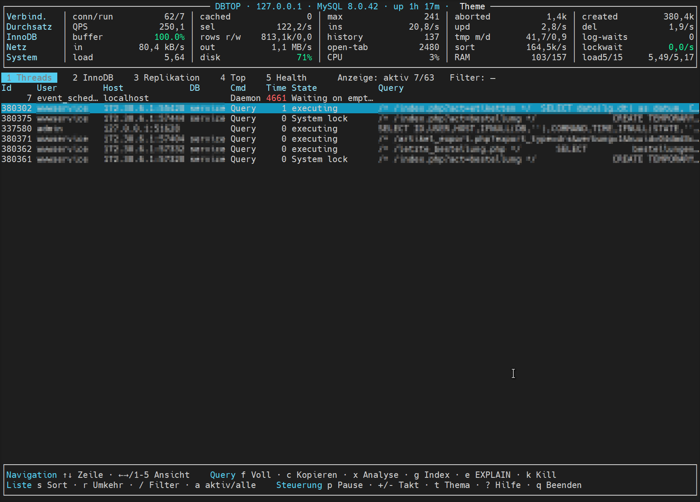

# dbtop

A fast terminal monitor for **MySQL 8** and **MariaDB 10** — like `top`, but for
databases. A single static binary, no dependencies.



[](https://paypal.me/masoenok)

## Highlights

- **Flicker-free:** data is fetched in the background; the display only updates
  changed cells — no visible reloading, no freezing on a slow DB.
- **Robust under load:** every query has a deadline; if the server stops
  answering, the header keeps the last good values (marked `● stale`) instead
  of wedging.
- **5 views** (keys `1`–`5` or `←/→`):
  1. **Threads** – live process list (sortable/filterable, long-running queries highlighted)
  2. **InnoDB** – buffer pool, history list, transactions, pending I/O
  3. **Replication** – IO/SQL status, seconds behind (MySQL & MariaDB)
  4. **Top** – largest tables
  5. **Health** – colour-coded health checks with recommendations + explained runtime metrics
- **Header dashboard:** QPS, threads, slow/full-join/scan rate, buffer hit, network,
  system (load, CPU, RAM, swap, disk) — plus a **full-width load-average graph**
  (3 rows high, normalized per core, colour-coded green/amber/red).
- **Query tools:** show full text (`f`), **copy** (`c`), **analyze** (`x`,
  heuristics with concrete index suggestions), **EXPLAIN** with verdict (`e`),
  **create index** (`g`, confirmed, online), **kill** (`k`, confirmed).
- **Light/dark theme** (`t`).
- **MySQL & MariaDB**, local or remote.

## Installation

**Quick (one line):**
```bash
curl -fsSL https://raw.githubusercontent.com/masoenok/dbtop/main/install.sh | sh
```
Detects the architecture, downloads the matching binary and installs it to
`/usr/local/bin/dbtop` (asks for `sudo` if needed). Works with `wget` instead of
`curl` as well. Override the destination via `DBTOP_DEST=/path`.

**Manual:**

1. Download the matching binary from [`bin/`](bin/):
   - `dbtop-linux-amd64` (x86-64)
   - `dbtop-linux-arm64` (ARM64)
2. Make it executable and install:
   ```bash
   sudo install -m 0755 dbtop-linux-amd64 /usr/local/bin/dbtop
   # or: chmod +x dbtop-linux-amd64 && sudo mv dbtop-linux-amd64 /usr/local/bin/dbtop
   ```
3. Verify the checksum (optional):
   ```bash
   sha256sum -c SHA256SUMS
   ```

Requirement on the target system: Linux. No additional packages needed
(statically linked). For the clipboard feature (`c`) the terminal should support
OSC 52 (e.g. Windows Terminal, iTerm2, kitty); otherwise dbtop saves the query
to a file instead.

## Quick start

```bash
dbtop                          # uses ~/.my.cnf, connects to localhost
dbtop -h 10.0.0.5 -u root -p   # different host, prompts for the password
dbtop -h db.internal -u monitor -p --interval 2
```

Connection parameters are resolved in the order
**flags > `DBTOP_*` environment variables > `~/.my.cnf`**.
The password is **never** passed visibly on the command line (prompt or `~/.my.cnf`).

| Flag | Meaning |
|---|---|
| `-h` | Host (default `127.0.0.1`) |
| `-P` | Port (default `3306`) |
| `-u` | User |
| `-p` | Password (empty = prompt) |
| `-S` | Socket |
| `--database` | Default database |
| `--defaults-file` | Path to my.cnf (default `~/.my.cnf`) |
| `--interval` | Refresh in seconds (default `1`) |

## Key bindings

| Key | Action |
|---|---|
| `1`–`5`, `←/→` | Switch view |
| `↑/↓` | Select row |
| `f` | Show full query text |
| `c` | Copy query (clipboard via OSC 52 + file fallback) |
| `x` | Analyze query (index/optimization hints) |
| `e` | EXPLAIN incl. verdict |
| `g` | Create suggested index (confirmed, `ALGORITHM=INPLACE, LOCK=NONE`) |
| `k` | Kill query (confirmed) |
| `s` / `r` | Sort column / direction |
| `/` | Filter · `a` active/all |
| `t` | Light/dark theme |
| `p` | Pause · `+/-` interval |
| `?` | Help · `q` Quit |

Detailed usage: see **[MANUAL.md](MANUAL.md)**.

> Note: the user interface is currently in German.

## Permissions

Reading/displaying: a user with `PROCESS` (and access to `information_schema`)
is enough. `k` (kill) requires `CONNECTION_ADMIN`/`SUPER`; `g` (create index)
requires the `INDEX`/`ALTER` privilege. Apart from that dbtop is **read-only** —
writing actions (kill, index) only happen after explicit confirmation.

## ☕ Support

Like dbtop? A small contribution towards further development is much
appreciated: **[paypal.me/masoenok](https://paypal.me/masoenok)** — thank you! 🙏

## License

[MIT](LICENSE) — © 2026 Andreas Derr. Provided as is, without warranty.
